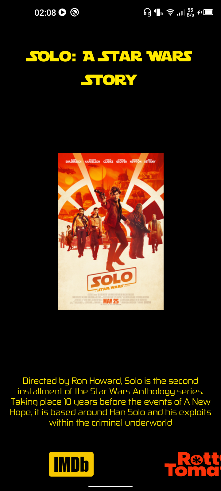

## XtarwarX API & Mobile Application Consumer
A C# Dotnet REST & GrapqhQL API with a Java Android mobile data viewer application

# API

### [Swagger](https://swagger.io/)
A swagger implementation for REST query troubleshooting, schema viewing and debbugging

     
    

#

TODO
- [Altair](https://altairgraphql.dev//) IDE Implementation
- [GraphiQL](https://github.com/graphql/graphiql/) IDE Implementation
- [GraphQL Playground](https://github.com/graphql/graphql-playground/) IDE Implementation
- [Voyager](https://github.com/IvanGoncharov/graphql-voyager/) IDE Implementation

#
## Data Repository

Data for api was generated primarily from
* [SWAPI API](https://swapi.dev/)
* [IGN](https://ign.com/)
* [IMDB](https://imdb.com/) 
* [Wikipedia](https://wikipedia.org/) 

View all data repository json files [here](/api.dotnet/Repository/Data) 

#
## Mobile Application
A simple application which consumes the api and allows for the viewing of data.
 

    
    
    
    
    

* Daichi Furiya's [Glide Transformations](https://github.com/wasabeef/glide-transformations)
* Bumptech's [Glide](https://github.com/bumptech/glide)
* Google's [Volley](https://github.com/google/volley)

#

TODO
- [ ] Sqlite Data Caching
- [ ] Theme Implementation

#

## License

>MIT License
>
>Copyright (c) 2023 Thando Ndlovu
>
>Permission is hereby granted, free of charge, to any person obtaining a copy
of this software and associated documentation files (the "Software"), to deal
in the Software without restriction, including without limitation the rights
to use, copy, modify, merge, publish, distribute, sublicense, and/or sell
copies of the Software, and to permit persons to whom the Software is
furnished to do so, subject to the following conditions:
>
>The above copyright notice and this permission notice shall be included in all
copies or substantial portions of the Software.
>
>THE SOFTWARE IS PROVIDED "AS IS", WITHOUT WARRANTY OF ANY KIND, EXPRESS OR
IMPLIED, INCLUDING BUT NOT LIMITED TO THE WARRANTIES OF MERCHANTABILITY,
FITNESS FOR A PARTICULAR PURPOSE AND NONINFRINGEMENT. IN NO EVENT SHALL THE
AUTHORS OR COPYRIGHT HOLDERS BE LIABLE FOR ANY CLAIM, DAMAGES OR OTHER
LIABILITY, WHETHER IN AN ACTION OF CONTRACT, TORT OR OTHERWISE, ARISING FROM,
OUT OF OR IN CONNECTION WITH THE SOFTWARE OR THE USE OR OTHER DEALINGS IN THE
SOFTWARE.
